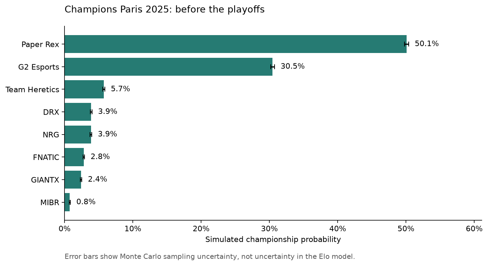
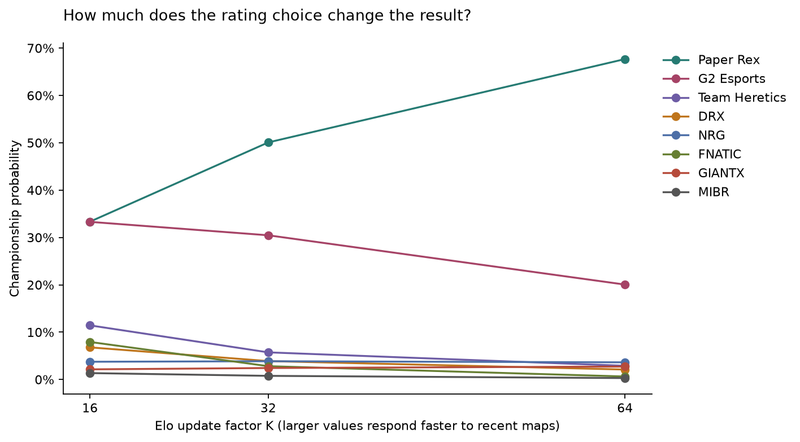

# VCT Monte Carlo

What would a simple rating model have said about Champions Paris 2025 before the playoffs started?
This project learns team ratings from earlier map results, then simulates the actual eight-team bracket 100,000 times. It is a retrospective analysis, not a prediction made in 2025.



## Results

Default run: Elo K=32, seed 42. Ratings use 2,335 maps from 918 completed series between January 2024 and September 25, 2025 (exclusive, UTC).

| Team | Win tournament | Reach final | Top four |
| --- | ---: | ---: | ---: |
| Paper Rex | 50.1% | 65.9% | 82.9% |
| G2 Esports | 30.5% | 49.4% | 72.9% |
| Team Heretics | 5.7% | 23.7% | 53.5% |
| DRX | 3.9% | 13.6% | 41.4% |
| NRG | 3.9% | 17.8% | 46.9% |
| FNATIC | 2.8% | 10.6% | 36.3% |
| GIANTX | 2.4% | 13.0% | 40.1% |
| MIBR | 0.8% | 6.0% | 25.9% |

NRG actually won, beating FNATIC in the final. Neither team ranked highly in this baseline. That does not, by itself, invalidate a probabilistic model, but it is a reason to examine what the ratings miss rather than claim the model predicted the event well.

The bigger warning is sensitivity to K, which controls how quickly Elo reacts to recent maps. Paper Rex moves from roughly 33% at K=16 to 68% at K=64. The narrow error bars in the first chart describe simulation noise only; they do not capture this much larger model uncertainty.



## How it works

- Every team starts at 1500. Each historical map updates both ratings using the usual Elo logistic probability with a 400-point scale.
- A single map win probability becomes a best-of-three or best-of-five series probability, assuming independent maps with the same probability.
- The simulator follows the real double-elimination bracket: four opening matches, crossed lower-bracket paths, a best-of-five lower final and grand final, and no grand-final reset.
- Ratings stay fixed during each simulated tournament. The output counts tournament wins, final appearances and top-four finishes.
- A fixed seed makes runs reproducible. No playoff outcomes enter the training CSV.

K=32 is a baseline choice, not a parameter selected to fit this event. For a separate rolling check, each of 188 series from July 1 through September 24 is predicted before any of its maps update the ratings. Brier score is **0.226** versus **0.250** for a coin flip; log loss is **0.644** versus **0.693**. Lower is better. This evaluates series predictions across the available dataset, not the calibration of tournament-winning probabilities.

## Run it

Python 3.11 or newer:

```sh
python -m venv .venv
source .venv/bin/activate
pip install -r requirements.txt
python main.py --sensitivity
python -m pytest -q
```

The bundled CSV is enough to run offline. Results go to `reports/`: a probability table, run metadata, and charts. For a shorter run or a different rating assumption:

```sh
python main.py --simulations 10000 --seed 7 --k 16 --output reports/quick
```

## Data and bracket

Map results come from [VCT Reference](https://vct-reference.com/dataset). The extraction script excludes showmatches, incomplete series and results whose map winners disagree with the series score. `data/source.json` records the extraction date, source database hash and filters. Stable team IDs keep sponsor/name changes from splitting a team; DRX uses its name at this tournament.

The format is documented in [Riot's Champions Paris guide](https://playvalorant.com/en-us/news/esports/everything-you-need-to-know-champions-paris/), and the opening matches follow the [official playoff bracket](https://valorantesports.com/en-US/tournament/113482263742879102/stage/113482431147251336). A test replays the recorded fourteen playoff outcomes to verify the bracket routing.

To refresh the source snapshot:

```sh
python scripts/import_data.py --refresh
```

This downloads the provider's current DuckDB export into ignored `data/raw/`, then applies the same historical cutoff. Upstream corrections can change the extracted history; the committed CSV is the reproducible snapshot used for the reported results. See the provider's [terms](https://vct-reference.com/terms). This project is for statistical analysis, not betting or gambling.

## Layout

```text
main.py                 CLI and report generation
src/ratings.py          Map Elo, series probabilities, rolling evaluation
src/tournament.py       Bracket routing and Monte Carlo sampling
src/data.py             CSV loading and validation
src/plots.py            Charts
scripts/import_data.py  Source extraction
data/                   Historical snapshot, provenance and event configuration
tests/                  Probability, bracket, data and CLI checks
reports/                Committed example outputs
```

## Limitations

The model does not know about rosters, map vetoes, patches, travel, LAN conditions or regional strength differences beyond observed results. All maps share one probability, and ratings are attached to organizations rather than player lineups. Initial ratings are equal; there is no inactivity decay. The dataset can also contain historical corrections or omissions.

Adding map-specific strengths and roster-aware ratings would be useful next steps. More simulations alone would not fix those assumptions.
